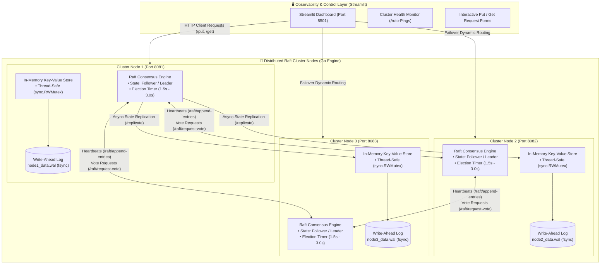
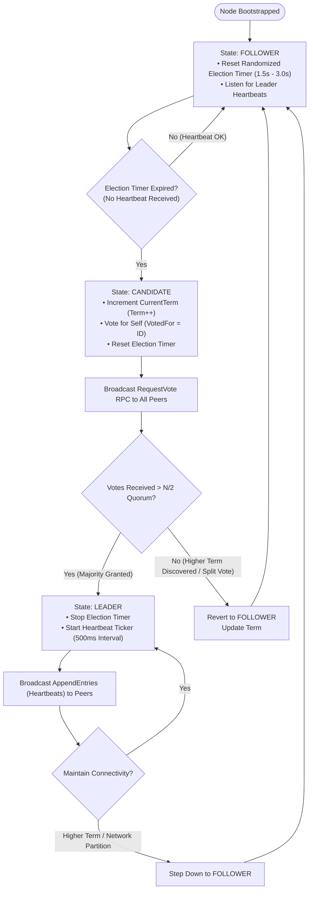
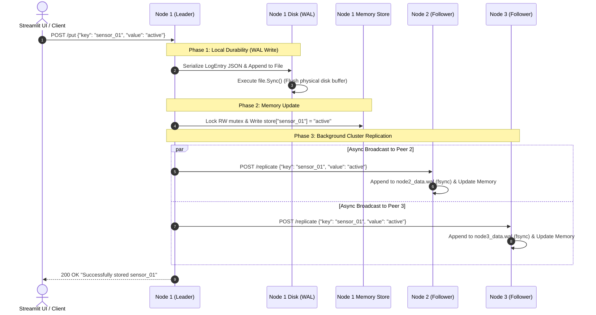

# 🌊 GoRaft-KV

[](https://golang.org/)
[](https://www.python.org/)
[](https://streamlit.io/)
[](https://raft.github.io/)
[-orange?style=for-the-badge)](https://en.wikipedia.org/wiki/Write-ahead_logging)
[](LICENSE)

> **A fault-tolerant, high-performance distributed Key-Value store built from scratch in Go.**  
> Powered by the **Raft Consensus Algorithm** for decentralized leader election and state synchronization, **Write-Ahead Logging (WAL)** with strict `fsync` disk durability guarantees, and a real-time **Streamlit control plane** for cluster observability and chaos testing.

---

## 📑 Table of Contents
- [🚀 Key Features](#-key-features)
- [🏗️ System Architecture](#️-system-architecture)
- [🔄 Processing Workflow & Diagrams](#-processing-workflow--diagrams)
  - [1. Raft Finite State Machine & Election Flowchart](#1-raft-finite-state-machine--election-flowchart)
  - [2. Write-Ahead Logging & Replication Sequence](#2-write-ahead-logging--replication-sequence)
  - [3. Deep-Dive Consensus & Durability Lifecycle](#3-deep-dive-consensus--durability-lifecycle)
- [🛠️ Tech Stack](#️-tech-stack)
- [🔌 API Reference](#-api-reference)
  - [Client Endpoints](#client-endpoints)
  - [Internal Raft & Cluster Endpoints](#internal-raft--cluster-endpoints)
- [📂 Project Structure](#-project-structure)
- [💻 Quickstart & Cluster Deployment](#-quickstart--cluster-deployment)
  - [Prerequisites](#prerequisites)
  - [1. Start Cluster Node 1 (Port 8081)](#1-start-cluster-node-1-port-8081)
  - [2. Start Cluster Node 2 (Port 8082)](#2-start-cluster-node-2-port-8082)
  - [3. Start Cluster Node 3 (Port 8083)](#3-start-cluster-node-3-port-8083)
  - [4. Launch the Streamlit Control Plane](#4-launch-the-streamlit-control-plane)
- [🧪 Fault Tolerance & Chaos Testing](#-fault-tolerance--chaos-testing)
- [🤝 Contributing](#-contributing)
- [📜 License](#-license)

---

## 🚀 Key Features

* **⚡ Raft Consensus Algorithm:** Fully decentralized state machine implementing `Follower`, `Candidate`, and `Leader` states with term increments and majority quorum ($> N/2$).
* **🎲 Randomized Election Timers:** Randomized timeout intervals ($1500\text{ms} - 3000\text{ms}$) completely prevent split-vote deadlocks during leader failures.
* **💾 Write-Ahead Logging (WAL) with `fsync`:** Every mutation (`PUT`) is serialized to an append-only `.wal` file on disk and flushed via physical `file.Sync()` before modifying memory, ensuring zero data loss during power cuts.
* **🔄 Instant Crash Recovery:** Nodes replay their local `.wal` audit log sequentially on boot to reconstruct the exact in-memory hash table state.
* **📡 Automated Heartbeats & Cluster Replication:** Active leaders broadcast heartbeat ping signals (`AppendEntries`) every 500ms and stream state mutations to all peer nodes asynchronously.
* **🔒 High-Concurrency In-Memory Engine:** Thread-safe key-value storage engine guarded by Go's high-performance `sync.RWMutex` for concurrent read/write scaling.
* **🖥️ Interactive Streamlit Dashboard:** Real-time visual control center displaying live cluster node health, automated failover routing, and interactive key-value read/write forms.

---

## 🏗️ System Architecture



---

## 🔄 Processing Workflow & Diagrams

### 1. Raft Finite State Machine & Election Flowchart



---

### 2. Write-Ahead Logging & Replication Sequence



---

### 3. Deep-Dive Consensus & Durability Lifecycle

#### Phase 1: Write-Ahead Logging (WAL) Protocol
In distributed storage, modifying in-memory state before persistent disk logging risks silent data corruption if the system crashes midway. **GoRaft-KV** guarantees strict ACID durability:
1. **Append-Only Write:** Mutations are encoded into atomic JSON records: `{"key": "...", "value": "..."}\n`.
2. **OS Physical Sync:** Calls `os.File.Sync()`, forcing the operating system kernel to flush write caches directly to the non-volatile drive.
3. **In-Memory Update:** Only after `fsync` succeeds is the `store[key] = value` map updated under a write lock (`mu.Lock()`).

#### Phase 2: Crash Recovery & Replay
When a killed node restarts, `storage.NewKVEngine()` triggers `wal.ReadAll()`. The engine scans the `.wal` file line-by-line from byte offset 0, executing an instant in-memory replay of all historical writes without needing expensive snapshotting.

#### Phase 3: Leader Election & Heartbeat Protocol
* **Heartbeat Period:** Every `500ms`, the Leader dispatches `POST /raft/append-entries` to prevent followers from initiating unnecessary elections.
* **Election Timeout:** Followers randomize their election timeouts between `1500ms` and `3000ms`. If no heartbeat arrives within this window, the node ascends to `Candidate` and requests peer votes (`POST /raft/request-vote`).
* **Majority Quorum:** A Candidate becomes Leader if and only if it obtains votes from $> \lfloor N/2 \rfloor$ nodes in the cluster.

---

## 🛠️ Tech Stack

| Domain | Technology | Purpose |
| :--- | :--- | :--- |
| **Core Language** | Go (Golang 1.21+) | High-speed concurrent backend engine |
| **Concurrency Primitives** | Go Goroutines, Channels, `sync.RWMutex` | Thread-safe locks & non-blocking replication |
| **Storage Engine** | Write-Ahead Log (WAL) + JSON | Disk persistence with kernel `fsync` guarantees |
| **Consensus Protocol** | Custom Raft Implementation | Decentralized leader election & heartbeats |
| **Observability Dashboard** | Python 3.9+, Streamlit | Interactive cluster health and chaos UI |
| **Networking** | Go `net/http` REST Protocol | RPC communication for votes, heartbeats & mutations |

---

## 🔌 API Reference

### Client Endpoints

#### 1. Store Key-Value Pair
`POST /put`  
Writes data to the active node, flushes to local WAL, and replicates to peer nodes.

* **Request (`application/json`):**
```json
{
  "key": "device_temperature",
  "value": "72.4F"
}
```
* **Response (200 OK):**
```text
Successfully stored device_temperature
```

---

#### 2. Retrieve Value by Key
`GET /get?key={key_name}`  
Reads a value directly from the node's thread-safe memory store.

* **Query Parameters:** `key` (string)
* **Response (200 OK):**
```text
72.4F
```
* **Response (404 Not Found):**
```text
Key not found
```

---

### Internal Raft & Cluster Endpoints

| Endpoint | Method | Payload | Description |
| :--- | :--- | :--- | :--- |
| `/raft/request-vote` | `POST` | `{"term": int, "candidate_id": string}` | Dispatched by candidates during leader election |
| `/raft/append-entries` | `POST` | `{"term": int, "leader_id": string}` | Heartbeat signal sent by leaders every 500ms |
| `/replicate` | `POST` | `{"key": string, "value": string}` | Internal data replication across cluster nodes |

---

## 📂 Project Structure

```
GoRaft-KV/
├── cmd/
│   └── server/
│       └── main.go          # HTTP server, CLI flags, REST & Raft routes
├── internal/
│   ├── raft/
│   │   └── consensus.go     # Raft state machine, election timers & RPCs
│   └── storage/
│       ├── engine.go        # Thread-safe KV engine & crash recovery replay
│       └── wal.go           # Write-Ahead Log (WAL) with fsync disk flushing
├── ui.py                    # Streamlit control plane & chaos testing UI
├── go.mod                   # Go module definition
├── .gitignore               # Ignores local *.wal binary logs
└── README.md                # System documentation
```

---

## 💻 Quickstart & Cluster Deployment

### Prerequisites
- **Go 1.21+** installed ([Download Go](https://go.dev/dl/))
- **Python 3.9+** & `pip`

```bash
# Clone the repository
git clone https://github.com/kailash6207/GoRaft-KV.git
cd GoRaft-KV

# Install Python requirements for the control plane
pip install streamlit requests
```

---

### 1. Start Cluster Node 1 (Port 8081)
Open **Terminal 1**:
```bash
go run cmd/server/main.go -port=8081 -id=node1 -peers=http://localhost:8082,http://localhost:8083
```

---

### 2. Start Cluster Node 2 (Port 8082)
Open **Terminal 2**:
```bash
go run cmd/server/main.go -port=8082 -id=node2 -peers=http://localhost:8081,http://localhost:8083
```

---

### 3. Start Cluster Node 3 (Port 8083)
Open **Terminal 3**:
```bash
go run cmd/server/main.go -port=8083 -id=node3 -peers=http://localhost:8081,http://localhost:8082
```

---

### 4. Launch the Streamlit Control Plane
Open **Terminal 4**:
```bash
streamlit run ui.py
```
> The dashboard will launch automatically at: `http://localhost:8501`

---

## 🧪 Fault Tolerance & Chaos Testing

You can simulate real-world hardware failure and test cluster durability in three simple steps:

1. **Write Data:** Open the Streamlit dashboard (`http://localhost:8501`) and store `config_status = "operational"`.
2. **Simulate Crash:** Go to **Terminal 1** (Node 1) and kill the process with `Ctrl + C`.
3. **Verify High Availability:**
   * Refresh the Streamlit dashboard: Node 1 will display as `OFFLINE`.
   * Search for `config_status`: Surviving nodes (Node 2 and Node 3) will immediately return `"operational"`.
4. **Test Crash Recovery:**
   * Restart Node 1 in Terminal 1.
   * Node 1 automatically replays `node1_data.wal` from disk and restores all data to memory instantly.

---

## 🤝 Contributing

Contributions, bug reports, and optimizations are welcome!
1. Fork the Project (`git checkout -b feature/NewFeature`)
2. Commit your Changes (`git commit -m 'feat: Add NewFeature'`)
3. Push to the Branch (`git push origin feature/NewFeature`)
4. Open a Pull Request

---

## 📜 License

Distributed under the **MIT License**. See `LICENSE` for details.

---

<div align="center">
  <sub>Built with ❤️ by <a href="https://github.com/kailash6207">Kailash N H</a></sub>
</div>
